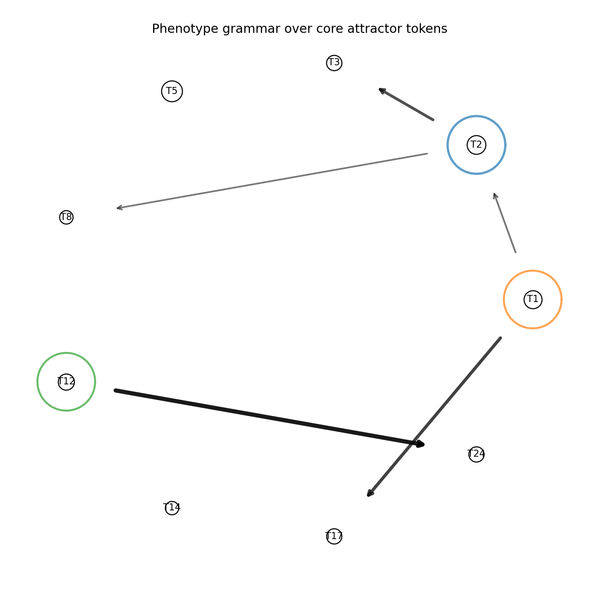
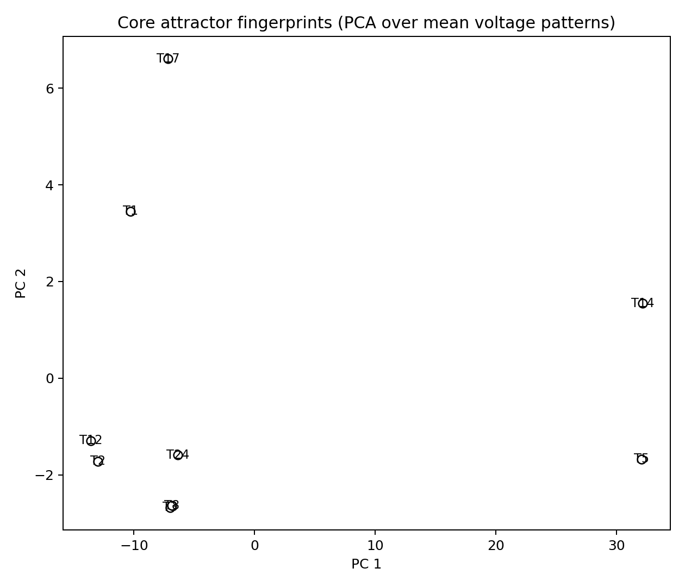

# Fuka-6.0  
**First Universal Kommon Ancestor (FUKA)**  
by Yasas (යසස් පොන්වීර)

---

## Overview

**Fuka-6.0** is a physics-first simulation platform exploring how **computation, symbols, code, and phenotype-like behavior can emerge from a primitive physical substrate** — without neurons, logic gates, or predefined intelligence.

The substrate is deliberately minimal:

- ❌ No neurons  
- ❌ No logic gates  
- ❌ No symbolic rules  
- ❌ No backpropagation  
- ❌ No pre-programmed intelligence  

Only:

- Capacitor-like dynamics  
- Local plasticity  
- Energy flow  
- Environmental forcing  
- Self-organization  

From this, the system **spontaneously develops**:

- Discrete attractor states (proto-symbols)  
- Sequences of attractors (proto-code)  
- Evolving connection topology (emergent hardware)  
- Long-memory pockets  
- Environment-modifying behavior (phenotype)

Fuka-6.0 is a **bottom-up and top-down unified model** of how computation may arise directly from physics.

> **Status:**  
> ⚙️ Long-running autotuned experiments are **currently still running**.  
> Results below summarize findings **so far**.

---

## 1. Motivation

Biological computation is not designed.  
It emerges from:

1. Physical substrates  
2. Energy gradients  
3. Self-reinforcing attractors  
4. Code-like symbolic transitions  
5. Phenotype behavior that feeds back on the environment  

Fuka-6.0 aims to model the **earliest possible version** of this process using the simplest substrate capable of storing and transforming information:

> **A network of capacitors with leak, coupling, and local adaptation**

The goal is to study how **computation, memory, symbols, hardware, and phenotype** can emerge together from pure physics.

---

## 2. Capacitor Substrate Model

The substrate consists of **N capacitors**.  
Each capacitor *i* has voltage \( V_i(t) \) and capacitance \( C_i \).

The dynamics follow:

\[
C_i \frac{dV_i}{dt}
= -\lambda_i V_i
+ \sum_j g_{ij}(V_j - V_i)
+ I_i(t)
\]

Where:

- \( C_i \) — capacitance  
- \( \lambda_i \) — leakage (natural memory decay)  
- \( g_{ij} \) — conductance between capacitors  
- \( I_i(t) \) — environmental energy injection  

This is the **minimal physical system** capable of storing, transforming, and stabilizing information.

---

## 3. Environment

The environment provides fluctuating energy input:

\[
I_i(t) = f_i(E(t), x_i)
\]

Where:

- \( E(t) \) — global environmental state  
- \( x_i \) — spatial or structural position  
- \( f_i \) — physical coupling from environment to substrate  

The environment is **purely physical**, not symbolic.

---

## 4. Plasticity (Learning Rule)

Connections adapt using a **purely local rule**:

\[
\frac{dg_{ij}}{dt}
= \eta F(t)\left( V_i V_j - \alpha g_{ij} \right)
\]

Where:

- \( \eta \) — learning rate  
- \( \alpha \) — decay  
- \( F(t) \) — global stability pressure  

### 4.1 Stability Pressure

\[
F(t) = -\frac{1}{N}\sum_i \left(\frac{dV_i}{dt}\right)^2
\]

Interpretation:

- Low turbulence → reinforce connections  
- High turbulence → decay connections  

This forms a **physics-driven evolutionary pressure**.

---

## 5. Attractors — The First Symbols

Repeated environmental forcing causes the system to settle into stable states:

\[
\mathbf{V}(t) \rightarrow A_k
\]

Each attractor:

- Is reproducible  
- Stable under perturbation  
- Low-turbulence  
- Persistent  

These attractors form the **first symbolic alphabet** of the system.

---

## 6. Attractor Sequences — The First Code

Environmental waves arrive in discrete slots:

1. Energy injection  
2. Relaxation  
3. Attractor stabilization  

Sampling yields sequences:

\[
A_{k_1}, A_{k_2}, A_{k_3}, \dots
\]

This is **proto-code**, emerging directly from physics.

---

## 7. Transition Graph — Proto-Grammar

Transitions \( A_i \rightarrow A_j \) form a directed graph.

Repeated transitions generate:

- Syntax  
- Operators  
- Memory cycles  
- Branching structures  

This graph is the earliest form of **grammar and computation**.

---

## 8. Emergent Hardware

Over time the conductance matrix organizes into:

- Hubs  
- Oscillators  
- Gating motifs  
- Long-range pathways  
- Feedback loops  

There is **no separate hardware layer**.  
Hardware *is whatever structure persists* under environmental pressure.

---

## 9. Phenotype — Acting Back on the Environment

The key milestone is a closed loop:

\[
\text{substrate} \leftrightarrow \text{code} \leftrightarrow \text{environment}
\]

When the system modifies its environment in ways that affect its own future states, a **phenotype** exists.

---

## 10. Phase-6 Phenotype Results (So Far)

From the run:
runs/exp_phenotype_fixed_20251129_230800.npz

### Core Alphabet

- 680 attractor samples  
- 293 distinct clusters  
- 9 core attractors (count ≥ 10)  
- Core coverage ≈ **58%**  

This shows strong **symbol reuse**, not random wandering.

### Emergent Grammar

Strong transitions include:

- T12 → T24 (P ≈ 0.73)  
- T1 → T17 (P ≈ 0.52)  
- T2 → T3 (P ≈ 0.45)  

Result: a **biased symbolic grammar**, not noise.

*Figure 1 — Core phenotype grammar graph.*

---

### Environment-Dependent Syntax

- Low-energy → exploratory behavior  
- High-energy → deterministic grammar  

Energy directly modulates syntax strength.

---

### Physical Grounding of Symbols

Attractor fingerprints (mean voltage vectors) cluster in substrate space.

*Figure 2 — PCA projection of attractor fingerprints.*

Symbols are **physically grounded**, not abstract labels.

---

## 11. Current Status & Future Work

🚧 **Autotuned long-run experiments are ongoing**  
(currently running for days to weeks)

Next objectives:

- Observe phase transitions in computation cost  
- Detect spontaneous self-tuning  
- Track emergence of long-range memory  
- Identify persistent phenotype loops  
- Study environment-induced grammar shifts  

The aim is to witness **self-organized computation without manual tuning**.

---

## Summary

Fuka-6.0 demonstrates — for the first time in this framework — that:

- Symbols can emerge from physics  
- Grammar can arise from attractor transitions  
- Hardware and code can co-evolve  
- Phenotype behavior can close the loop  

All without neurons, logic, or supervision.

This repository documents an **ongoing experiment in the origin of computation itself**.