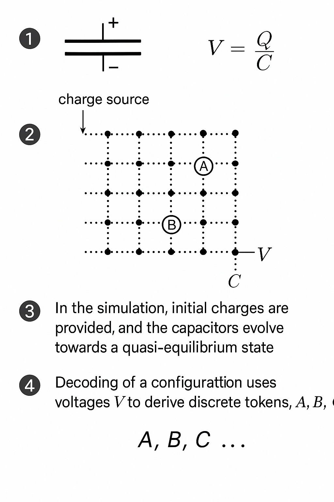
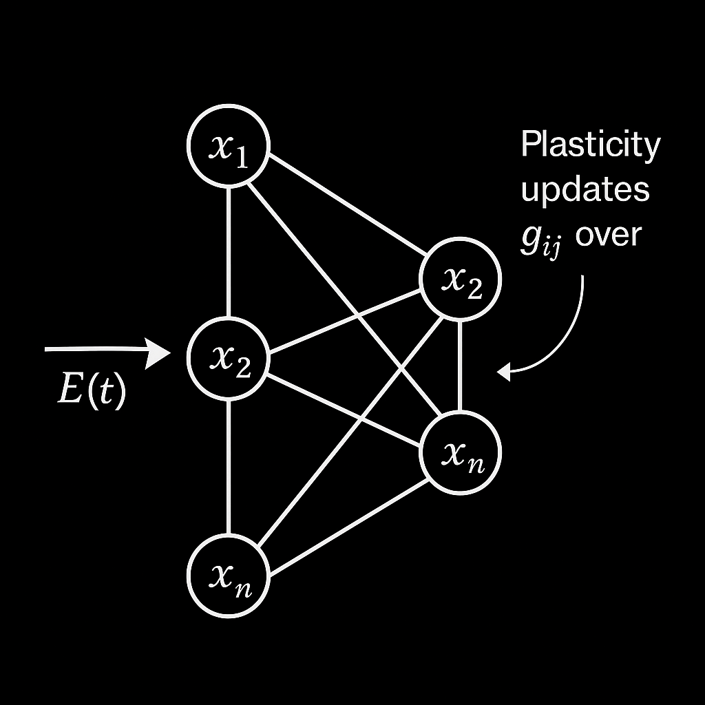
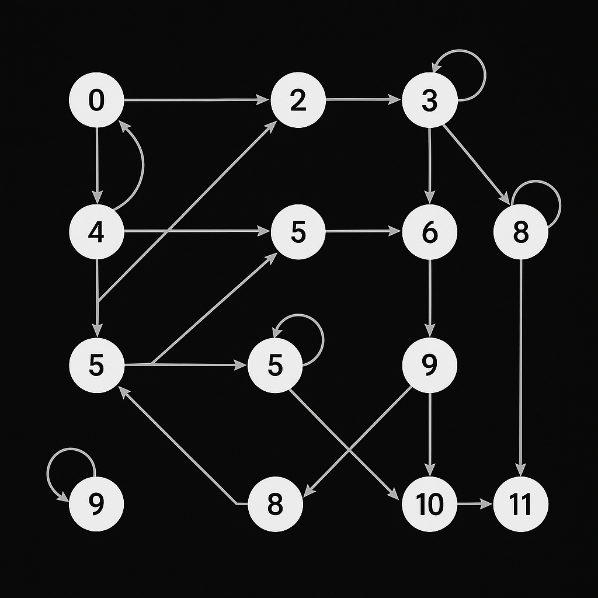

📘 How Capacitors Work — and How Fuka Capacitors Compute

This section explains, in simple language, how real capacitors behave and how the Fuka-6.0 substrate uses a generalized capacitor model to create emergent symbols, code, and hardware.

### How a Real Capacitor Works

⸻

🧩 1. What is a capacitor?

A capacitor is the simplest device that can store and change electrical state.

It holds energy by separating charge.
Three important facts:

✔ It has a voltage

✔ It changes that voltage over time

✔ It stores energy in the electric field

The equations are:

Q = C V                  (charge = capacitance × voltage)
I = C dV/dt              (current changes voltage)
E = ½ C V²               (energy stored)

⸻

🧩 2. Why capacitors matter for computation

Capacitors naturally create:
	•	memory (stored voltage)
	•	dynamics (voltages evolve in time)
	•	attractors (stable voltage patterns)
	•	pattern separation (different states converge to different minima)

These are the same ingredients used by:
	•	neural networks
	•	analog computers
	•	Hopfield networks
	•	early biological systems

Capacitor networks naturally form state machines.

### How Fuka-6.0 Capacitors Work

⸻

🧩 3. The Fuka-6.0 idea: A universe of capacitors

In Fuka-6.0, we generalize this idea.

We simulate a network of n abstract capacitors:

x = [x₁, x₂, x₃, ..., xₙ]

Each value xᵢ is the voltage of that capacitor at time t.

These capacitors interact through a conductance matrix:

g[i,j] = strength of coupling from capacitor j → i

This determines how charge “flows” between units.

### Transition Graph (Attractor Finite-State Machine)

⸻

🧩 4. What drives the capacitors?

There are three forces that change capacitor voltages.

⸻

(1) Internal dynamics (like charge flow)

Capacitors equalize through conductances:

Δxᵢ ∝ Σ gᵢⱼ ( xⱼ − xᵢ )

This creates:
	•	attractors
	•	stable patterns
	•	state convergence

These attractors eventually become symbols.

⸻

(2) External environment forcing

The environment (A, B, C or analog wave) pushes the system:

Δxᵢ ∝ α · E(t)

This is like an electrode injecting charge.

Environment → shapes the attractor basins → creates a consistent alphabet.

⸻

(3) Plasticity (rewiring the hardware)

Conductances change over time:
	•	connections strengthen
	•	unused paths decay
	•	modules form

This is how the substrate self-builds its own hardware.

In code, g is updated by local rules:

gₜ₊₁ = gₜ + f(local_state)

This is the heart of Fuka’s emergent hardware.

⸻

🧩 5. What encodes a symbol?

A symbol is not stored explicitly.

Instead:

✔ Symbols = attractor basins in state space

Example:

A = cluster of states near pattern pA
B = cluster near pB
C = cluster near pC

The substrate repeatedly falls into these patterns whenever the environment returns to the same regime.

This is how the alphabet emerges.

⸻

🧩 6. What encodes code?

Code emerges as the sequence of transitions between attractors.

Example:

A → B → B → A → ...

Each arrow is a directed transition in the attractor graph.

This graph is physically created by:
	•	the capacitor dynamics
	•	the conductance layout
	•	the influence of environment

This is equivalent to a proto grammar or a finite state machine.

⸻

🧩 7. What encodes hardware?

Hardware = the conductance matrix g.

This is the “wiring” of the substrate:

g =
[ g11 g12 g13 ... ]
[ g21 g22 g23 ... ]
[ ...            ]

Over time:
	•	g acquires structure
	•	modules appear
	•	repeated motifs emerge
	•	certain pathways become specialized

The substrate is literally building its own circuitry.

This is the link between:

physics → hardware → symbols → code → adaptation

⸻

🧩 8. Full mapping between physics and simulation

Real World	Fuka Capacitor Model	Meaning
Voltage	xᵢ	State/memory
Charge flow	Σ gᵢⱼ(xⱼ − xᵢ)	Interaction dynamics
External field	E(t)	Environment force
Cap geometry	plasticity	Hardware evolution
Energy minima	attractors	Symbols
State transitions	attractor shifts	Code
Circuit topology	conductance g	Hardware

This is the clean unification:

Capacitors → attractors → symbols → code → hardware → adaptation

⸻

🧩 9. Why this is important

This framework explains how:
	•	computation can emerge from physics
	•	symbols can emerge from pure dynamics
	•	hardware and code co-evolve
	•	adaptation becomes possible without pre-built structures
	•	biological systems may have originated

This is the conceptual foundation of Fuka-6.0.

